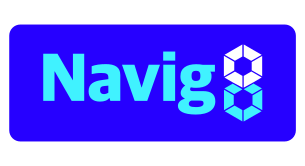

# Navig8

## Simplify and Visualize Helm Deployments



The Navig8 web user interface simplifies Kubernetes application deployment by guiding users through [Helm Chart values](https://helm.sh/docs/chart_best_practices/values/).

It's logic executes only on frontend side which guarantees no sensitive data filled in its form will ever be implicitly processed somewhere outside user's computer.

---
 
## Table of contents
* [Assumptions](#assumptions)
* [Local development](#local-development)
  + [Environment requirements](#environment-requirements)
  + [To start locally:](#to-start-locally)
    - [Using Makefile (from scratch)](#using-makefile-from-scratch)
    - [Using Makefile (after everything is already installed and set)](#using-makefile-after-everything-is-already-installed-and-set)
    - [Without Makefile (from scratch)](#without-makefile-from-scratch)
    - [Without Makefile (after everything is already installed and set)](#without-makefile-after-everything-is-already-installed-and-set)
* [Customization options](#customization-options)
  + [Environment variables for the FE:](#environment-variables-for-the-fe)
  + [Environment variables for build in CORS proxy:](#environment-variables-for-build-in-cors-proxy)
  + [Custom logo](#custom-logo)
  + [Themization](#themization)
  + [Overwriting CSS rules](#overwriting-css-rules)
* [Deployment as FE static](#deployment-as-fe-static)
  + [An example of deployment flow](#an-example-of-deployment-flow)
* [Deployment as Docker container](#deployment-as-docker-container)
* [Examples](#examples)
* [Roadmap](#roadmap)

## Assumptions
- Navig8's initial design is lightweight: all functionality is in the web client for easy web hosting.
  - There is no persistence for values or back-end requirements, see the [Roadmap](#roadmap) section for more on this topic.
- The target Helm Chart repository is network accessible to the web client running Navig8.- 
  - The target Helm Chart has [values.schema.json](https://helm.sh/docs/topics/charts/#schema-files)
  - OPTIONAL: the target Helm Chart has a `README.md`.
  - Navig8 leverages existing Helm Chart value specifications, see the [Roadmap](#roadmap) section for more on this topic.
- Navig8 provides `helm` commands for execution.

## Local development
### Environment requirements
- [Node.js](https://nodejs.org/en/) with version ^16
- [pnpm](https://pnpm.io/) with version ^7
- (Optional) Makefile support

### To start locally:
#### Using Makefile (from scratch)
```shell
cd frontend & cp .env.template .env.development.local # Add values for required variables there. Each variable is documented inside the file.
cd .. # Go to the root of the repo
make start
```
#### Using Makefile (after everything is already installed and set)
```shell
make start
```
#### Without Makefile (from scratch)
```shell
cd backend && pnpm install && pnpm start # Install and run backend
# Go to the separate terminal/cmd
cd frontend && pnpm install
cp .env.template .env.development.local # Add values for required variables there. Each variable is documented inside the file.
pnpm dev
```
#### Without Makefile (after everything is already installed and set)
```shell
cd backend && pnpm start # Install and run backend
# Go to the separate terminal/cmd
cd frontend && pnpm dev
```

## Customization options
### Environment variables for the FE:

| Name                                                                              | Required | Description                                                                                                                                                                                                                                                           | Default                                                                                                                                                |
|-----------------------------------------------------------------------------------|----------|-----------------------------------------------------------------------------------------------------------------------------------------------------------------------------------------------------------------------------------------------------------------------|--------------------------------------------------------------------------------------------------------------------------------------------------------|
| NAVIG8_REPO_URL                                                                   | *        | Url to the helm repository that is usually used in `helm add repo` command                                                                                                                                                                                            |                                                                                                                                                        |
| NAVIG8_REPO_ENTRY                                                                 | *        | Entry is a unique key of the entries hash map (<br>https://helm.sh/docs/topics/chart_repository/#the-index-file<br>)                                                                                                                                                  |                                                                                                                                                        |
| NAVIG8_REPO_NAME                                                                  | *        | The name of the repo used in the command `helm repo add $NAVIG8_REPO_NAME $NAVIG8_REPO_URL`                                                                                                                                                                           |                                                                                                                                                        |
| NAVIG8_PREDEFINED_NAMESPACE                                                       |          | The k8s namespace that will be created and used for the helm installation                                                                                                                                                                                             |                                                                                                                                                        |
| NAVIG8_DOCUMENTATION_URL                                                          |          | Link to the documentation for the specified helm chart that will be provided to the user                                                                                                                                                                              |                                                                                                                                                        |
| NAVIG8_CORS_PROXY_URL                                                             |          | This value is usually used for the local development or for package solutions like Docker<br><br>If you set custom cors proxy for the Docker environment it won't run default CORS proxy server                                                                       | `http://localhost:9000/` for local development<br/>`/proxy/` for the Docker instance<br/><br/> To disable CORS proxy approach just set an empty string |
| NAVIG8_COPYRIGHT                                                                  |          | A string that will be shown on the right of the `<footer>` element. If you want to add a dynamic year that will represent year at the momet - add `{year}` to the string. <br> <br> Example: `©{year} Kasten by Veeam®`                                               |                                                                                                                                                        |
| NAVIG8_FAVICON                                                                    |          | Icon that can be usually seen inside the tab of the browser and is usually important for crawlers of social media, chat applications, and search engines.                                                                                                             |                                                                                                                                                        |
| NAVIG8_SEO_TITLE                                                                  |          | A small string that represents the content of the page that can be usually seen inside the tab of the browser and is usually important for crawlers of social media, chat applications, and search engines.                                                           |                                                                                                                                                        |
| NAVIG8_METAS                                                                      |          | An array as JSON string with data for custom `<meta>` elements in html<br><br>The structure is (Typescript definition):<br>`type Metas = Array<{name: string, content: string}>`<br><br>Example: <br>`[{"name": "description", "content": "This is my description"}]` | '[]'                                                                                                                                                   |
| NAVIG8_LINKS                                                                      |          | An array as JSON string with attributes for custom `<link>` elements in html<br><br>The structure is (Typescript definition):<br>`type Links = Array<Record<string, string>>`<br><br>Example: `[{"rel": "canonical", "href": "http://example.com"}]`                  | '[]'                                                                                                                                                   |
| NAVIG8_TOP_HEAD<br/>NAVIG8_BOTTOM_HEAD<br/>NAVIG8_TOP_BODY<br/>NAVIG8_BOTTOM_BODY |          | Raw html that will be inserted in the index.html and will be statically served. Each variable name represents location where html will be inserted.                                                                                                                   | ""                                                                                                                                                     |
| NAVIG8_BASE_URL                                                                   |          | URL relative to the domain root or an absolute one that represents path to the frontend folder with built static<br/><br/>Example: `/pages/navig8`                                                                                                                    | '/'                                                                                                                                                    |

### Environment variables for build in CORS proxy:
Navig8 uses [cors-anywhere](https://github.com/Rob--W/cors-anywhere) as cors proxy server. These variables are pushed forward to it.

| Name                               | Required | Description                                                                                                                                   | Default                           |
|------------------------------------|----------|-----------------------------------------------------------------------------------------------------------------------------------------------|-----------------------------------|
| NAVIG8_CORS_PROXY_WHITELIST        | *        | (array as JSON string) Whitelist of request origins. It is highly recommended to specify at least the domain where navig8 frontend is hosted. | '[]' That represents "Not filter" |
| NAVIG8_CORS_PROXY_REQUIRED_HEADERS |          | (array as JSON string) HTTP header names that are required to be in request.                                                                  | '[]'                              |
| NAVIG8_CORS_PROXY_FILTER_HEADERS   |          | (array as JSON string) HTTP header names that should be cut out from the response.                                                            | '[]'                              |


### Custom logo
By default, an `icon` from the manifest of the specified helm repo is used as a logo in the header of the interface.

It can be overwritten with the CSS rule `background-image` inside `.logo` class in the `frontend/light.css` that is responsible for the light theme (We assume that we will support the dark theme as well in the nearest future)
The logo can be of any format supported by the browser (but `.svg` is highly recommended)

This is how it could be done using only the terminal:
```shell
LOGO_URL=url
cat >> frontend/light.css <<- EOF
.logo {
   background-image: url($LOGO_URL);
}
EOF
```

You can also add a file there and set a relative path:
```shell
cp /some/where/else/logo.svg frontend/logo.svg
cat >> frontend/light.css <<- EOF
.logo {
   background-image: url(./logo.svg);
}
EOF
```

### Themization
The interface is built using [PrimeVue UI-kit](https://www.primefaces.org/primevue/) which makes it possible to customize a theme.

It's possible to make the color scheme more brand-specific by setting it CSS variable in `frontend/light.css` file that is dedicated to CSS overwrites for the light theme (We assume that we will support the dark theme as well in the nearest future).

[There is](https://www.primefaces.org/primevue/colors) a description of color palettes that this UI kit uses.

The method of adding a new scheme to the `light.css` file can be the same as for [custom logo](#custom-logo)
```shell
cat >> frontend/light.css <<- EOF
:root {
  --primary-color:#3B82F6;
  --primary-color-text:#ffffff;
  /* other colors */
}
EOF
```

### Overwriting CSS rules

Feel free to fork this repo and change styles or whatever you want, but if a fork is not the preferable option -
an overwriting can be done in the same way as for [custom logo](#custom-logo) and [themization](#themization)

## Deployment as FE static

1. Build frontend static using [Available Customization options](#customization-options).
2. Deployment to the server that serves static html/js/css
3. CORS header `Access-Control-Allow-Origin` should be extended for the specified helm chart repo files with the domain where navig8 is run.

We have plans on simplifying this process. Please see the [Roadmap](#roadmap) section for more details

### An example of deployment flow
It is assumed that we are inside the process where `pnpm`, `git` and `node` are available ([Environment requirements](#environment-requirements)).

1. Clone the repo
```shell
git clone git@github.com:navig8s/navig8.git
```

2. Install dependencies (If your environment doesn't support `Makefile` see [flow of installation without Makefile](#without-makefile-from-scratch))
```shell
make install 
```
3. Setup at least required ENV variables declared in [this table](#build-time-environment-variables-for-the-fe).
You can do it inside the terminal process of course.
```shell
NAVIG8_REPO_URL=repo_url
NAVIG8_REPO_ENTRY=entry
NAVIG8_REPO_NAME=name
```
4. Build the frontend
```shell
cd frontend
pnpm build 
cd ..
```
5. Copy the output of FE static inside `frontend/dist` folder anywhere you want.
6. Set `Access-Control-Allow-Origin` for the helm repo you've specified so navig8 could fetch all files it needs.
For example, you host navig8 at `https://navig8-instance.com`. This should be included in the `Access-Control-Allow-Origin` header for all files in the specified helm chart.

## Deployment as Docker container
Docker solution could be run in [k8s cluster](https://kubernetes.io/) or by one of the popular cloud services like [Google Cloud Run](https://cloud.google.com/run)

1. Get last image from [ghcr registry](https://github.com/navig8s/navig8/pkgs/container/navig8)
2. Set at least required environment variables from the list for [FE](#environment-variables-for-the-fe) and [CORS proxy](#environment-variables-for-build-in-cors-proxy)
3. Publish the Container's port `80`, forward requests to domain of your choice to it as it will be listened for requests.
4. Run Container

## Examples

- [Coming soon]: [install.kasten.io](https://install.kasten.io) is a public Navig8 instance for the K10 Helm Chart.

## Roadmap

- [x] Prebuilt Docker image with CORS proxy inside
- [ ] Possibility to skip `values.schema.json` file for the form construction
- [ ] Possibility to view and edit `values.yaml` file
- [ ] Dark theme support
- [ ] Code of Conduct
- [ ] Issues template
