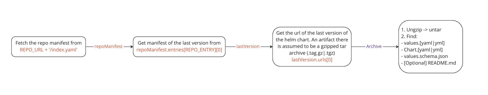

# How parsing algorithm works

## Table of contents:

* [Fetching algorithm](#fetching-algorithm)
* [Parsing of the `values.schema.json`](#parsing-of-the-valuesschemajson)
    + [Some resources](#some-resources)
    + [Main rules](#main-rules)
    + [Supported types of values declared in `schema`](#supported-types-of-values-declared-in-schema)
      + [String](#string)
      + [Number](#number)
      + [Integer](#integer)
      + [Boolean](#boolean)
      + [An object with dynamic keys (to create ingress annotations for example)](#an-object-with-dynamic-keys-to-create-ingress-annotations-for-example)
      + [An object with properties](#an-object-with-properties)
      + [An array](#an-array)

## Fetching algorithm



## Parsing of the `values.schema.json`

### Some resources

- [What is a JSON schema?](https://json-schema.org/)
- [How helm originally uses it?](https://helm.sh/docs/topics/charts/#schema-files)

### Main rules
- `values.schema.json`
- [Helm.sh](https://helm.sh/docs/topics/charts/#schema-files) declares `values.schema.json` as a schema file for 
linting the structure and values of the `values.yaml`. Thus `Navig8` assumes that `values.schema.json` declares an 
object on the top level of the file.
```json
{
  "$schema": "link",
  "type": "object",
  "properties": {}
} 
```

### Supported types of values declared in `schema`

### String
Supported keys (All optional):

| Key         | Description                                                                                                                            | Default                                              |
|-------------|----------------------------------------------------------------------------------------------------------------------------------------|------------------------------------------------------|
| title       | Short title dedicated to its value                                                                                                     | The interface fallbacks to the full key path instead |
| description | Longer description of the value                                                                                                        |                                                      |
| default     | Default value that will be used in case `values.yaml` doesn't have it                                                                  |                                                      |
| enum        | A list of possible values. The interface will render `<select>` element. If omitted an `<input type="text">` will be rendered instead. |                                                      |

Minimal working example (it will be skipped otherwise):
```json
{
  "type": "string"
}
```

Full example:
```json
{
   "type": "string",
  "title": "Container images pullPolicy",
  "description": "What pullPolicy should be used",
  "default": "Always",
  "enum": ["IfNotPresent", "Always", "Never"]
}
```

### Number
Supported keys (All optional):

| Key         | Description                                                                                                                              | Default                                              |
|-------------|------------------------------------------------------------------------------------------------------------------------------------------|------------------------------------------------------|
| title       | Short title dedicated to its value                                                                                                       | The interface fallbacks to the full key path instead |
| description | Longer description of the value                                                                                                          |                                                      |
| default     | Default value that will be used in case `values.yaml` doesn't have it                                                                    |                                                      |
| enum        | A list of possible values. The interface will render `<select>` element. If omitted an `<input type="number">` will be rendered instead. |                                                      |

Minimal working example (it will be skipped otherwise):
```json
{
  "type": "number"
}
```

Full example:
```json
{
  "type": "number",
  "title": "Number",
  "description": "This is just a number. Choose whatever you want.",
  "default": 2.2,
  "enum": [1, 2.2, 3]
}
```

### Integer
This values is like a [number](#number), but an interface forces it to be only an integer (number can be float as well).

Supported keys (All optional):

| Key         | Description                                                                                                                             | Default                                              |
|-------------|-----------------------------------------------------------------------------------------------------------------------------------------|------------------------------------------------------|
| title       | Short title dedicated to its value                                                                                                      | The interface fallbacks to the full key path instead |
| description | Longer description of the value                                                                                                         |                                                      |
| default     | Default value that will be used in case `values.yaml` doesn't have it                                                                   |                                                      |
| enum        | A list of possible values. The interface will render `<select>` element. If omitted an `<inputtype="number">` will be rendered instead. |                                                      |

Minimal working example (it will be skipped otherwise):
```json
{
  "type": "integer"
}
```

Full example:
```json
{
  "type": "integer",
  "title": "Integer",
  "description": "This is just an integer. Choose whatever you want.",
  "default": 3,
  "enum": [1, 2, 3]
}
```

### Boolean
Supported keys (All optional):

| Key         | Description                                                                                                                             | Default                                              |
|-------------|-----------------------------------------------------------------------------------------------------------------------------------------|------------------------------------------------------|
| title       | Short title dedicated to its value                                                                                                      | The interface fallbacks to the full key path instead |
| description | Longer description of the value                                                                                                         |                                                      |
| default     | Default value that will be used in case `values.yaml` doesn't have it                                                                   |                                                      |

Minimal working example (it will be skipped otherwise):
```json
{
  "type": "boolean"
}
```

Full example:
```json
{
  "type": "boolean",
  "title": "Boolean",
  "description": "This is just a boolean. Choose whatever you want.",
  "default": true,
}
```

### An object with dynamic keys (to create ingress annotations for example)
Supported keys (All optional):

| Key         | Description                                                                                                                             | Default                                              |
|-------------|-----------------------------------------------------------------------------------------------------------------------------------------|------------------------------------------------------|
| title       | Short title dedicated to its value                                                                                                      | The interface fallbacks to the full key path instead |
| description | Longer description of the value                                                                                                         |                                                      |
| default     | Default value that will be used in case `values.yaml` doesn't have it                                                                   |                                                      |

Minimal working example (it will be skipped otherwise):
```json
{
  "type": "object"
}
```

Full example:
```json
{
  "type": "object",
  "title": "Key/value pairs",
  "description": "These are key/values pairs. Create your own or delete defaults",
  "default": {
    "nginx.ingress.kubernetes.io/auth-type": "basic",
    "nginx.ingress.kubernetes.io/proxy-body-size": "8m",
    "nginx.ingress.kubernetes.io/enable-influxdb": "false"
  },
}
```

### An object with properties
Such an object will be treated as just another level in the tree. Only the key will be taken from it 
and added to the key chain to values on its leafs.

Supported keys:

| Key         | Required | Description                            |
|-------------|----------|----------------------------------------|
| properties  | *        | Declaration of the object's properties |

A single variant of implementation (it will be skipped otherwise):
```json
{
  "type": "object",
  "property": {
    "myProperty": {[declaration here]},
    "anotherProperty": {[declaration here]}
  }
}
```

### An array

Supported keys:

| Key         | Required | Description                                                                                                                              | Default                                              |
|-------------|----------|------------------------------------------------------------------------------------------------------------------------------------------|------------------------------------------------------|
| title       |          | Short title dedicated to its value                                                                                                       | The interface fallbacks to the full key path instead |
| description |          | Longer description of the value                                                                                                          |                                                      |
| default     |          | Default value that will be used in case `values.yaml` doesn't have it                                                                    |                                                      |
| items       | *        | A declaration of the structure of the array's items. Should be an object. If it's a list of object the first declaration will be taken.  |                                                      |

An array of strings as minimal working example:

```json
{
  "type": "array",
  "items": {
    "type": "string"
  }
}
```

An array of objects as minimal working example (see [an object with properties](#an-object-with-properties)):

```json
{
  "type": "array",
  "items": {
    "type": "object",
    "properties": {[declaration of properties]}
  }
}
```

Full example:
```json
{
  "type": "array",
  "title": "An array",
  "description": "This is an array of very important values:)",
  "default": ["first important item", "second important item"],
  "items": {
    "type": "string",
  }
}
```